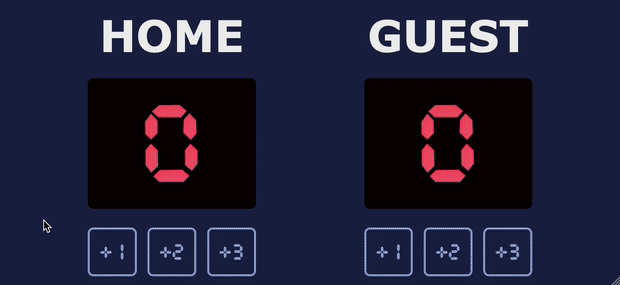

# Solo Project: Hometown Homepage

This is the first JavaScript project in the Scrimba Frontend Developer Career Path.

## Table of contents

-   [Overview](#overview)
    -   [The challenge](#the-challenge)
    -   [Screenshot](#screenshot)
    -   [Links](#links)
-   [My process](#my-process)
    -   [Built with](#built-with)
    -   [What I learned](#what-i-learned)
    -   [Continued development](#continued-development)
    -   [Useful resources](#useful-resources)
-   [Author](#author)

## Overview

### The challenge

The challenge was to create a simple Basketball Scoreboard app.

### Screenshot

### Links

-   Solution URL: <https://github.com/gdsimoes/scrimba-basketball>
-   Live Site URL: <https://gdsimoes.github.io/scrimba-basketball/>

## My process

### Built with

-   Figma
-   Semantic HTML5 markup
-   CSS custom properties
-   Flexbox
-   JavaScript

### What I learned

The focus of this project was to practice using JavaScript to manipulate the DOM. I have some experience with JavaScript, but primarily using Node, so this was a valuable exercise for me. On the design side of things, I learned how to use my own fonts without using a service like [Google Fonts](https://fonts.google.com/) and reviewed how to style buttons using pseudo-classes.

As "stretch goals," I highlighted the leader's score and created the reset function, which is fired whenever the user presses the 'r' key. To do this, I had to refresh my memory on how to toggle classes and how keyboard events work in JavaScript.

### Continued development

I look forward to creating more complex websites using advanced programming techniques.

### Useful resources

-   [MDN - aspect-ratio](https://developer.mozilla.org/en-US/docs/Web/CSS/aspect-ratio) - The `aspect-ratio` property is not quite ready for production, but I wanted to gain some experience with it. As usual, MDN clearly and succinctly explains how this property works.
-   [MDN - @font-face](https://developer.mozilla.org/en-US/docs/Web/CSS/@font-face) - Since I used my own fonts for the first time, I had to learn how to set up the CSS for this, i.e., how to use `@font-face`.
-   [freeCodeCamp - CSS Button Style](https://developer.mozilla.org/en-US/docs/Web/CSS/@font-face) - This article explains best practices for styling buttons using CSS.

## Author

-   Website - <https://gdsimoes.com>
-   LinkedIn - [Guilherme Dias Simoes](https://www.linkedin.com/in/gdsimoes)
